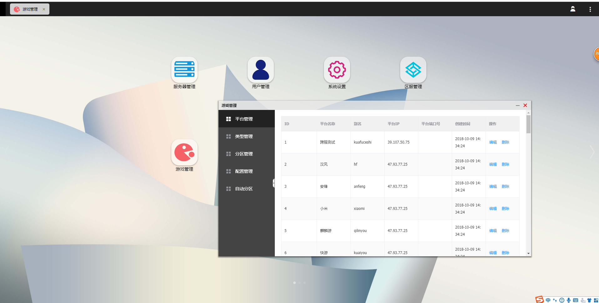

## 项目运行（nodejs 6.0+）
``` bash
# 克隆到本地
git clone https://github.com/Greensoon/vue-window-ui.git

# 进入文件夹
cd vue-window-ui

# 安装依赖
npm install / yarn

# 开启本地服务器localhost:3000
npm run dev

# 开启带本地服务的开发模式
npm start

# 发布环境
npm run create
```

## 路由配置
```js
import App from '../App'
import Component from '..'

export default [{
    path: '/',
    component: App,
    children: [{
        path: '',
        component: Component
    }]
}]

```


## 配置actions
```js
import ajax from '../config/ajax'

export default {
	fn({ commit, state }, id) {
		commit(ACTION_SUCCESS)
	},
}

```

## mutations
```js
const ACTION_SUCCESS  = 'ACTION_SUCCESS'

export default {
	//点击进入下一题
	[ACTION_SUCCESS](state, json) {
		state.var += json;
	},
}
```

## 创建store
```js
import Vue from 'vue'
import Vuex from 'vuex'
import mutations from './mutations'
import actions from './action'


Vue.use(Vuex)

const state = {

}

export default new Vuex.Store({
	state,
	actions,
	mutations
})
```


## 创建vue实例
```js
import Vue from 'vue'
import VueRouter from 'vue-router'
import routes from './router/router'
import store from './store/'

Vue.use(VueRouter)
const router = new VueRouter({
	routes
})

new Vue({
	router,
	store,
}).$mount('#app')
```

---
本系统使用 菜单即应用的风格进行布局，菜单可以进行拖动，窗口支持放大缩小，拖动，关闭，并和顶部窗口形成联动关系。

本系统脱离传统的路由模式，所有窗口均在/layout 下进行。

如下图:
