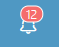
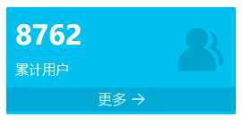
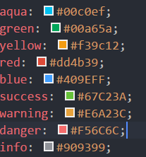
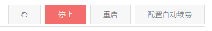
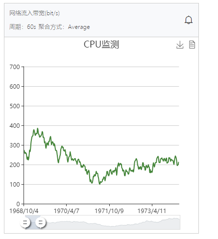
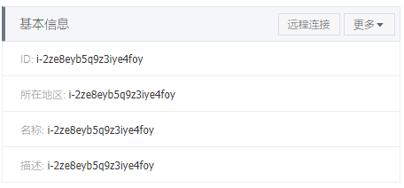
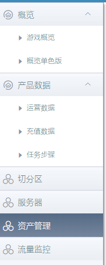
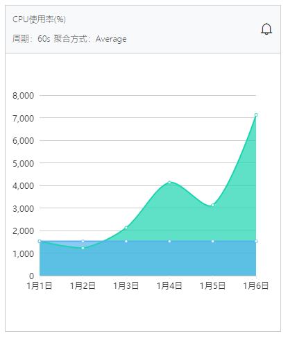
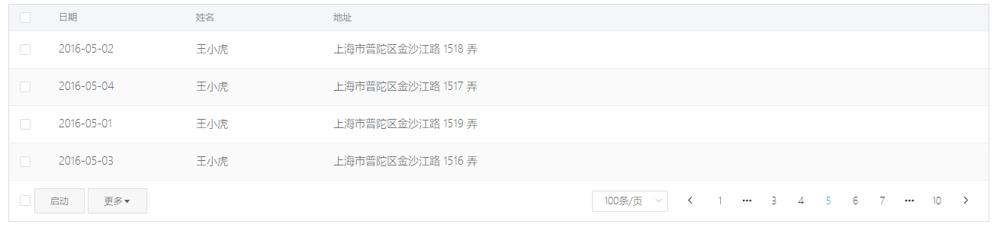
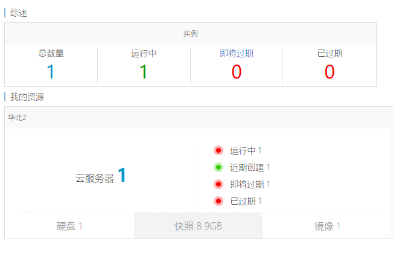

# 自定义组件说明

---
## tabs（tab切换）
参数 | 说明 | 示例
- | :-: | -: 
tabType | Array[{name: '', type: ''}]| <tabs :tabType=""></tabs> 
Hermione Granger | Gryffindor | 100 
Draco Malfoy | Slytherin | 90

---

## mu-badge (提醒)

  示例：

  参数：
    num: string or number 数量

  使用：
    ```
      <mu-badge num="12"></mu-badge>
    ```


---

## mu-block (色块)
  示例：

  
  参数：

      type: 块类型，目前值有
                  empty 空
                  aqua
                  green
                  yellow
                  red
                  blue
                  success
                  warning
                  danger
                  info
            为块背景底色，空处理flex浮动填充色块


      num: 数值，number 或 string 类型
      label: 文字描述，string
      link：链接，string,
      icon: 图标，图标classname
      light：色块显示的类型，light为底色为白色

  使用：
~~~
  <mu-block type="danger" icon="zaixian" label="全服在线人数" num="2"></mu-block>
  <mu-block type="empty"></mu-block>
~~~

---

## mu-breadcrumb （面包屑）


---

## mu-button (按钮)

  说明：对element-ui button的二次封装

  示例：

  参数：
  ~~~
        label: 文字,
        icon：纯图标按钮标识，该值为icon的classname，如该值存在，当传label时hover出现文字描述
        hover：hover的类型，目前有 danger warn, hover时背景色改为对应的底色
        small：按钮的size 小号
        middle: 按钮的size 中号
        disabled： 按钮是否可用
        img：按钮中使用图片
  ~~~

  使用：

  ~~~
    <mu-button icon="el-icon-refresh" label="刷新"></mu-button>
    <mu-button label="停止" hover="danger"></mu-button>
    <mu-button label="重启" hover="warn"></mu-button>
    <mu-button label="配置自动续费"></mu-button>
  ~~~

  ---

## mu-chart

    示例：

    参数：
      type: 类型，分为line 折线图  zhu：柱状图 bar：条形图 pie： 饼图 monitor：监视图, ring: 环形图
      data: 参照[v-charts](https://v-charts.js.org/)文档，
            其中monitor的参数说明如下：
              data: {
                xData: 对应x轴数据 
                yData: 对应y轴数据，为数组，[{name: 'CPU使用率', data}]
              }

      options: 具体参照[v-charts](https://v-charts.js.org)文档，
              其中monitor的参数说明：
              options: {
                title: '', 标题 类型：string
                subTitle: '', 二级标题 类型：string
                xAxis: , x轴坐标配置 类型: obj
                yAxis: , y轴坐标配置 类型：obj
                showDZ: 是否显示数据缩放工具条, 可以参照echarts文档进行重写 类型：boolean
                dataView: dataView的覆盖函数 类型：function
              }
      title: '标题'
      legend-position: 数据说明位置 center left right bottom
      legend-visible: 数据说明是否显示

      默认显示工具条下载和显示数据结构

      具体参数需要根据实际需求进行增加或者删减，尽量减少不必要的代码
  ---

## mu-excel

---

## filter-form

---

## instance-panel

  示例：
  
  子元素：
    ```
    instance-panel-title
    instance-panel-content
    ```

  使用：


    <instance-panel>
      <instance-panel-title title="基本信息">
        <mu-button label="远程连接" small></mu-button>
        <mu-button label="更多" small img="el-icon-caret-bottom"></mu-button>
      </instance-panel-title>
      <instance-panel-content>
        <ul class="mu-infolist">
          <li class="mu-infoitem">
            <span class="mu-info--label">ID:</span>
            <span class="mu-info--value">i-2ze8eyb5q9z3iye4foy</span>
          </li>
          <li class="mu-infoitem">
            <span class="mu-info--label">所在地区:</span>
            <span class="mu-info--value">i-2ze8eyb5q9z3iye4foy</span>
          </li>
          <li class="mu-infoitem">
            <span class="mu-info--label">名称:</span>
            <span class="mu-info--value">i-2ze8eyb5q9z3iye4foy</span>
          </li>
          <li class="mu-infoitem">
            <span class="mu-info--label">描述:</span>
            <span class="mu-info--value">i-2ze8eyb5q9z3iye4foy</span>
          </li>
        </ul>
      </instance-panel-content>
    </instance-panel>


## mu-menus

  说明：基于element-ui的二次封装
  <br>
  示例：
  
  参数：

    
    menus: 数组
    
  使用：

    <side-menus :menus="menus"></side-menus>
    this.menus = []

---

## monitor-panel

  示例：

    参数：
      title：标题 string, 
      desc 描述，对应标题下面的描述，为[], [{name: '', value: ''}], 
      showSet 是否显示标题头部的提醒铃铛, 
      setHandler 提醒铃铛的click事件

---

## panel

---

## table

  说明：是对element-ui table组件和分页组件，以及底部按钮的二次封装
  示例：

  参数：

    showIndex 是否显示索引index
    showCheckbox 是否显示checkbox
    tableData 数据
    stripe 隔行换底色

  使用：
  
    
    <mu-table :table-data="tableData" stripe show-checkbox></mu-table>

---

## mu-wrap

  示例：

  子组件：wrap-block wrap-block-item

  wrap-block-item 
    参数：

      label: 标题
      value: 值
      color: 颜色
      type: 类型，有link
      to: 如果类型是link，可以传to跳转地址


  参数：
      title

  使用：
    
    <mu-wrap title="综述">
      <wrap-block title="实例" class="col-48">
          <wrap-block-item label="总数量" value="1" color="normal"></wrap-block-item>
          <wrap-block-item label="运行中" value="1" color="running"></wrap-block-item>
          <wrap-block-item label="即将过期" value="0" type="link" to="/instance"></wrap-block-item>
          <wrap-block-item label="已过期" value="0" color="failed" to="/test"></wrap-block-item>
      </wrap-block>
      <wrap-block title="快照" class="col-48">
          <wrap-block-item label="快照容量" value="8.9GB" ></wrap-block-item>
          <wrap-block-item label="总数量" value="1"></wrap-block-item>
      </wrap-block>
    </mu-wrap>
  

